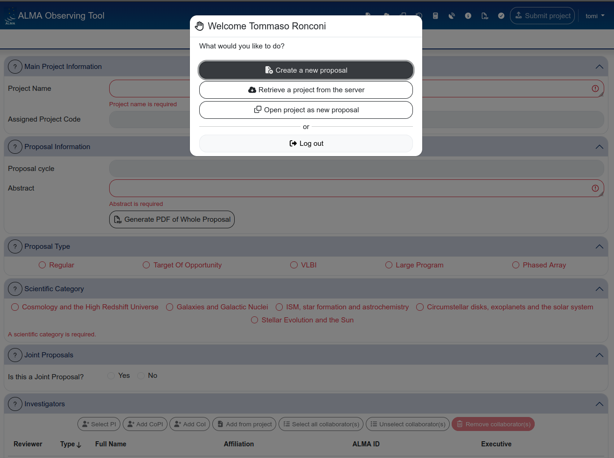
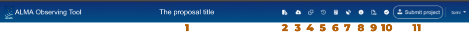
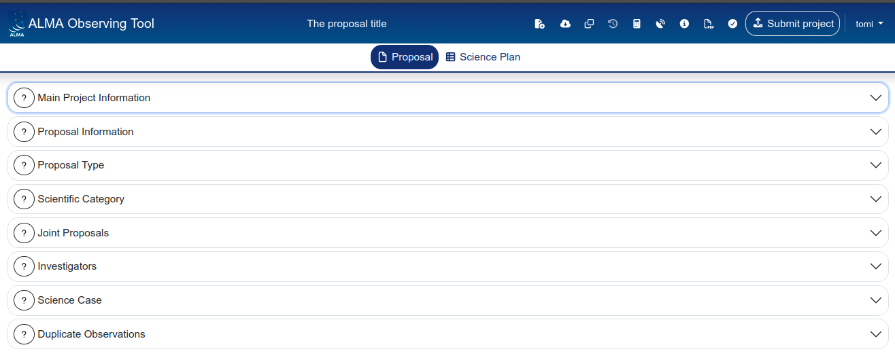
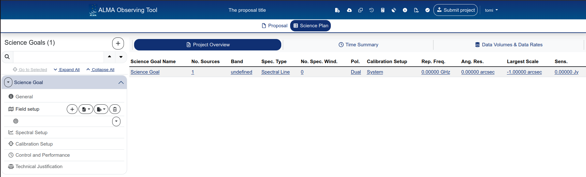

# Navigating the Web OT

This section gives you a quick tour of the web-based OT interface, so you know where things are before diving into the actual proposal content.

## Accessing the OT

The web-based OT is available at [https://cycle-13.sps.alma.cl/ngot](https://cycle-13.sps.alma.cl/ngot). You log in with your ALMA Science Portal credentials — the same account you use for the ALMA helpdesk, the archive, and previous OT versions.

{: .note }
If you don't have an ALMA account yet, you can register at [https://almascience.eso.org/](https://almascience.eso.org/).

## The welcome screen

After logging in, you are presented with three options:

- **Create a new proposal** — starts a fresh draft proposal.
- **Retrieve a project from the server** — opens a draft or submitted proposal from the staging area (see [Validation and submission](08_validation_and_submission.md) for details on proposal statuses).
- **Open project as new proposal** — makes a copy of an existing draft or submitted proposal. The copy is created in draft status.

## The header bar

Once a proposal is open, the top of the page displays a dark blue header bar. This bar is always visible and gives you access to the main actions and tools.

From left to right, the header bar contains:

1. **Proposal title** — displayed in the centre of the bar.
2. **Create a new (draft) proposal** — same as the welcome screen action.
3. **Retrieve a project from the server** — opens the staging area.
4. **Open project as new proposal (i.e. make a copy)** — duplicates the current proposal as a new draft.
5. **Revert project to last submitted version** — only active for submitted proposals with unsubmitted changes. Discards all changes made after the last submission.
6. **Sensitivity calculator** — opens the sensitivity calculator in a new tab.
7. **Configuration tables** — opens a panel with detailed configuration information (angular resolution, MRS, etc.) for each array configuration at the current frequency.
8. **OT documentation** — link to the official OT documentation pages.
9. **Generate proposal PDF** — produces a PDF summary of the proposal.
10. **Validate** — runs the proposal validation (checks for errors and missing information).
11. **Submit project** — submits the proposal to the ALMA archive.

{: .tip }
The header bar icons are small and not labelled. Hover over each icon to see a tooltip with its function. It is worth spending a minute familiarising yourself with the icon positions — you will use "Validate" and "Generate PDF" frequently.

## The two main tabs: Proposal and Science Plan

Below the header bar, two tabs control the main view:

- **Proposal** — contains the general proposal information: project name, abstract, proposal type, scientific category, investigators, science case, and duplicate observations.
- **Science Plan** — contains the science goals, which is where the bulk of the technical setup happens (field setup, spectral setup, calibration, control and performance, technical justification).

{: .important}
All the technical observing setup lives under "Science Plan", not under "Proposal"

We will cover each of these tabs in detail in the following sections.

## The Science Plan sidebar

When you switch to the Science Plan tab, a sidebar appears on the left listing your science goals. Each science goal can be expanded to reveal its subsections:

- **General** — name and description of the science goal (optional, but useful for your own reference)
- **Field setup** — source coordinates, pointings, spatial visualiser
- **Spectral Setup** — receiver band, spectral windows, spectral line picker
- **Calibration Setup** — calibration strategy and astrometry options
- **Control and Performance** — angular resolution, sensitivity, time estimate, configuration information
- **Technical Justification** — free-text justification for sensitivity, imaging, and correlator setup

Above the sidebar, you also have access to three summary views:

- **Project Overview** — a table summarising all science goals at a glance
- **Time Summary** — total time breakdown per array (12m, 7m, TP)
- **Data Volumes & Data Rates** — estimated data volumes

Science goals can be added with the **+** button next to the "Science Goals" heading. They can also be copied or deleted using the dropdown arrow next to each science goal's name.

{: .tip }
> If you have multiple science goals with similar setups, use the **copy** function rather than creating new ones from scratch. This copies all the technical settings (field setup, spectral setup, etc.) and lets you modify only what differs.

We will go back to these information in the following pages.

## A note on saving and editing

As mentioned in the [introduction](01_introduction.md), the web-based OT autosaves continuously. There is no "Save" button and no undo. Every change you make is immediately written to the server.

{: .warning }
> There is no version history and no undo. If you overwrite a field, the previous value is gone. If you are about to make significant changes to a working proposal, consider making a copy first using "Open project as new proposal" from the header bar.

---

[← Before you start](02_before_you_start.md) · [Next: The Proposal section →](04_proposal_section.md)
