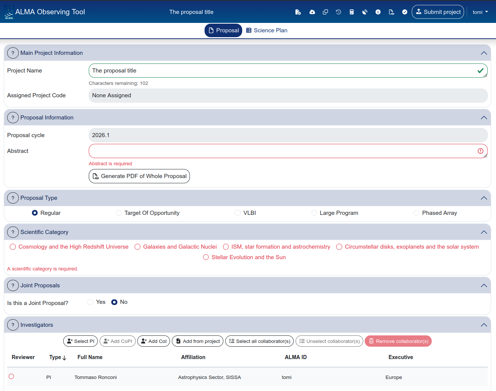
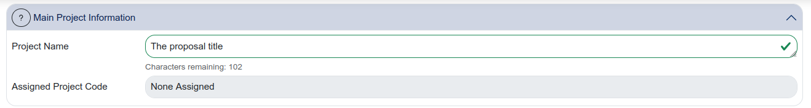
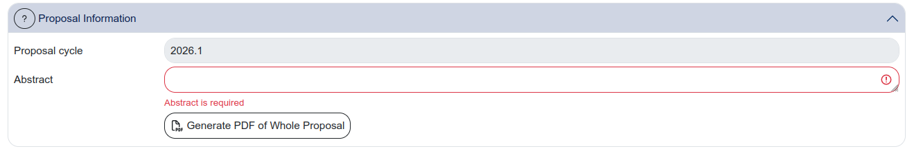
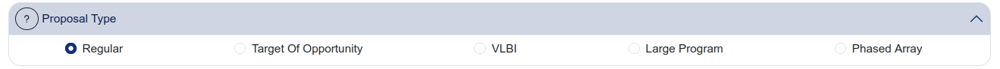
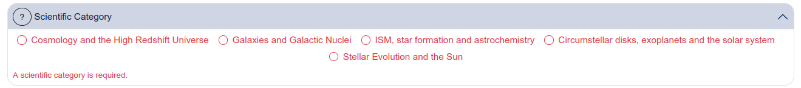
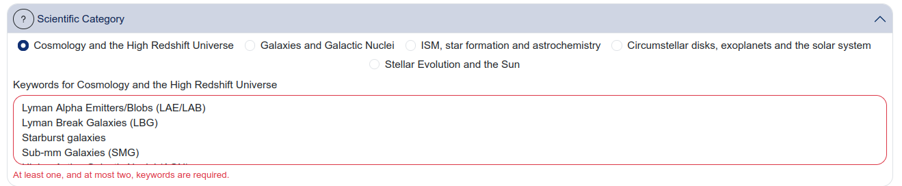
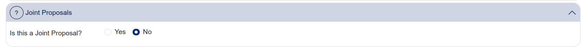
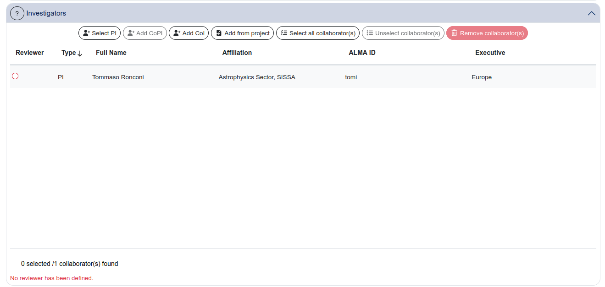
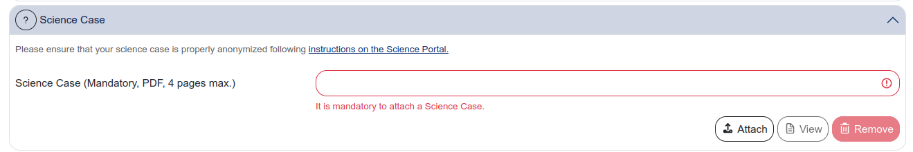
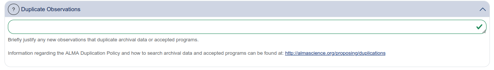

# The Proposal section

The **Proposal** tab contains the general metadata of your proposal: who is proposing, what kind of proposal it is, and the high-level science description. None of the technical observing setup lives here — that is all under the [Science Plan](05_science_plan.md) tab.

The Proposal tab is organized as a series of collapsible panels. Let's go through each one.

## Main Project Information

This panel contains two fields:

- **Project Name** — a short, descriptive title for your proposal. This is a required field.
- **Assigned Project Code** — automatically assigned by the system. It will show "None Assigned" until the proposal is submitted.

## Proposal Information

This panel shows:

- **Proposal cycle** — pre-filled and not editable (e.g. 2026.1).
- **Abstract** — a free-text field for the proposal abstract. This is a required field.
- **Generate PDF of Whole Proposal** — a button that generates a PDF preview of the entire proposal, including all science goals and technical justification.

## Proposal Type

Select the type of proposal you are submitting. The available options are:

- **Regular** (default)
- **Target of Opportunity**
- **VLBI**
- **Large Program**
- **Phased Array**

{: .note }
Unless you have a specific reason to choose otherwise, leave this as "Regular". The other proposal types have additional requirements and constraints that are documented in the [ALMA Proposer's Guide](https://almascience.eso.org/proposing/proposers-guide).

## Scientific Category

Select the scientific category that best describes your proposal (i.e. **only one**). The categories are:

- Cosmology and the High Redshift Universe
- Galaxies and Galactic Nuclei
- ISM, star formation and astrochemistry
- Circumstellar disks, exoplanets and the solar system
- Stellar Evolution and the Sun

When the scientific category has been chosen, a menu opens from where one or more keywords better describing your proposal focus.

{: .note }
These are both required fields. The scientific category and keywords are used by the review panel assignment process.

## Joint Proposals

If your proposal requires coordinated observations with another observatory (e.g. JWST, VLA, VLT), select "Yes" and specify the details. For most proposals, this is set to "No".

## Investigators

This panel manages the list of people involved in the proposal.

<!-- IMAGE NEEDED: proposal_investigators.png
     Screenshot of the Investigators panel showing the buttons
     (Select PI, Add CoPI, Add CoI, Add from project, Select all
     collaborator(s), Unselect collaborator(s), Remove collaborator(s))
     and the table below with at least one entry showing the columns:
     Reviewer, Type, Full Name, Affiliation, ALMA ID, Executive.
     
     This panel has a lot of functionality packed into a row of small
     buttons. Annotating or highlighting the button row would help
     users find the right action.
-->

By default, the person who creates the proposal is set as **PI**. You can change the PI using the "Select PI" button — if you do, the previous PI is automatically added as a Co-I.

Other investigators are added using:

- **Add CoPI** — adds a Co-Principal Investigator
- **Add CoI** — adds a Co-Investigator
- **Add from project** — imports investigators from another proposal you have access to

{: .important }
> All investigators listed on the proposal (PI, CoPI, CoI) have access to the proposal in the staging area and can edit it. Since autosaving is always active, this means any investigator can modify the proposal at any time.
>
> Coordinate with your collaborators to avoid simultaneous editing. There is no locking mechanism and no conflict resolution — the last save wins.

## Science Case

This panel provides a text field where you describe the scientific justification for your proposal. This is the main body of the proposal text that reviewers will read.

{: .tip }
The Science Case text field supports basic formatting. Depending on the cycle, there may be a character limit — check the current Proposer's Guide for the exact constraints.

{: .note}
The system will check whether the limits have been respected: do not cheat, the system knows.

## Duplicate Observations

This panel asks whether your targets have been observed by ALMA before, or whether there are other proposals requesting similar observations. If there are duplicates, you are expected to explain why your proposal is still justified (e.g. different angular resolution, different frequency, different sensitivity).

{: .warning }
This is a required field and reviewers pay attention to it. Failing to acknowledge known duplicates can negatively affect your proposal's evaluation.

---

[← Navigating the Web OT](03_navigating_the_web_ot.md) · [Next: The Science Plan →](05_science_plan.md)
