# The Science Plan

The **Science Plan** tab is where the technical specification of your observations is defined. This is where you will spend most of your time in the OT.

A proposal contains one or more **science goals** (SG). Each science goal defines a self-contained set of observations: the targets, the spectral setup, the calibration strategy, and the desired performance (angular resolution, sensitivity).
Note that, a SG can include up to five tunings per group of sources within 10 degrees on the sky, except for SGs that request long-baseline configurations, for which the grouping is limited to sources within 1 degree. Spectral scans or observations of targets with different radial velocities can thus be achieved within the same SG.

If you need to observe different targets with different setups, or the same target at different frequencies, or in any case not entering within the conditions listed above, you create separate science goals.

By default, a new proposal contains one empty science goal. Additional science goals can be added using the **+** button next to the "Science Goals" heading in the left sidebar.

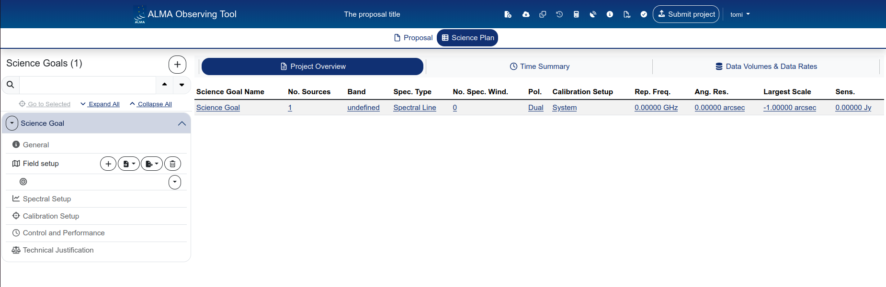

{: .tip}
You can always come back to this plan overview by clicking on the "Science Plan" icon, below the header bar.

Let's walk through each subsection of a science goal.

---

## General

The General panel contains two **optional** fields:

- **Science goal name** — a label for your own reference (e.g. "CO(9-8) observation" or "Band 7 continuum"). This name appears in the sidebar and in the Project Overview table.
- **Description** — a free-text note. This is not included in the submitted proposal; it is purely for your own bookkeeping.

{: .tip }
If you have multiple science goals, give them descriptive names. The default name "Science Goal" becomes confusing fast when you have three of them.

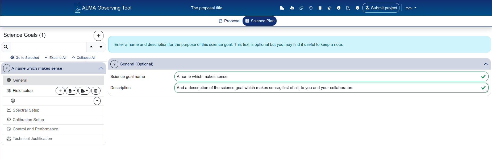

---

## Field setup

The Field setup defines the source(s) you want to observe and how the telescope should point at them.
By default, a science goal comes with an empty field. From the side-bar, you can add, import, export, delete or copy a field:

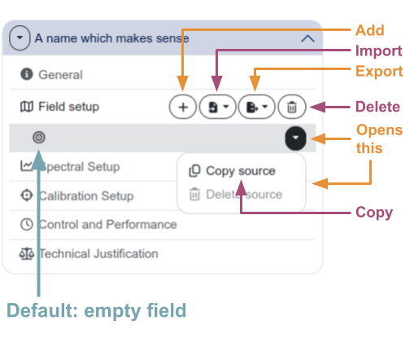

### Source information

For each source, you specify:

- **Source name** — a free-text name. You can use "Resolve source" to look up coordinates from SIMBAD/NED.
- **Coordinate system** — ICRS by default, with a sexagesimal display option.
- **RA and Dec** — in the selected format.
- **Parallax, proper motion (PM RA, PM Dec)** — relevant for nearby or fast-moving objects.
- **Source Radial Velocity** and **redshift (z)** — the Doppler convention and reference frame can be selected (LSRK by default).
- **Doppler Type** — RADIO is the default.
- **Target Type** — Individual Pointing(s) or Rectangle, depending on whether you are observing a single pointing, a set of discrete pointings, or a mosaic.

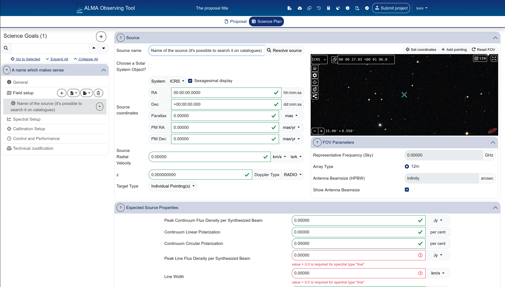

### Spatial visualiser

The right side of the Field setup panel displays the **spatial visualiser**, which is a browser-based version of the [Aladin interactive sky atlas](https://aladin.cds.unistra.fr/aladin.gml) (and it operates basically in the same way). It shows the sky around your source coordinates, with overlays for the antenna beam size and any pointings you have defined.

You can:

- Pan and zoom the sky view
- Toggle overlays (pointings, beam size, target centre)
- Load your own **FITS image** by clicking the **+** button next to "Survey" and selecting "FITS image file"
- Click the expand icon (top-right of the visualiser) for a full-window view

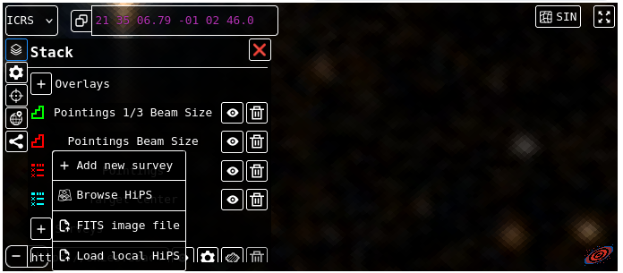

{: .important}
The spatial visualiser has the only purpose of helping you while using the OT. No info about what happens within that panel will be uploaded at submission time.

### FOV Parameters

{: .note}
If you do not perform the [Spectral Setup](#spectral-setup) first, this section would be undefined.

Below the spatial visualiser, the **FOV Parameters** section shows:

- **Representative Frequency (Sky)** — the sky frequency used to calculate the field of view and beam size.
- **Array Type** — 12m or 7m.
- **Antenna Beamsize (HPBW)** — automatically calculated from the representative frequency and array type.
- **Show Antenna Beamsize** — toggle to display the beam overlay in the visualiser.

### Target type and pointings

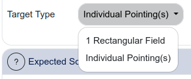

The **Target Type** dropdown controls how the telescope points at the source:

**Individual Pointing(s):**  
For single-pointing or multi-pointing observations. You can add individual pointings in the visualiser or specify their coordinates explicitly. Pointings can also be imported from a file (e.g. defined in CARTA).

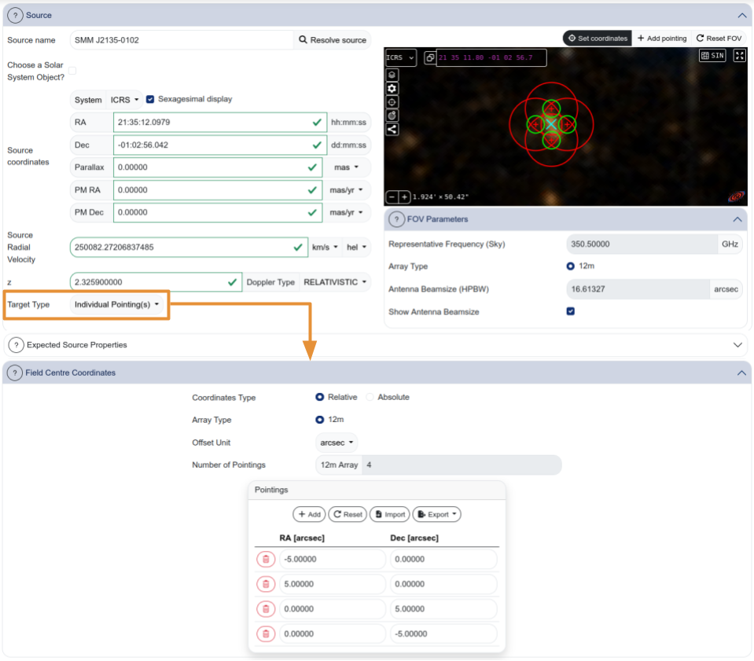

{: .warning }
> Individual pointings can be **shown** in the visualiser but currently cannot be **added**, **moved or removed** through the visualiser interface. If you need to adjust pointings, use the coordinate table or re-import them.
>
> The "Reset FOV" button resets both the field of view **and** any overlays that were removed. Use it with care.

{: .note}
> By default, pointings are expressed in coordinates relative to the centre of the FoV.
> This behaviour can be changed by selecting "Absolute" as "Coordinate Type"

**Rectangle:**  
For rectangular mosaic fields. You specify the field centre offset, dimensions (p length, q length), position angle, and spacing. The number of pointings for both the 12m and 7m arrays is calculated automatically (after the spectral setup is defined).

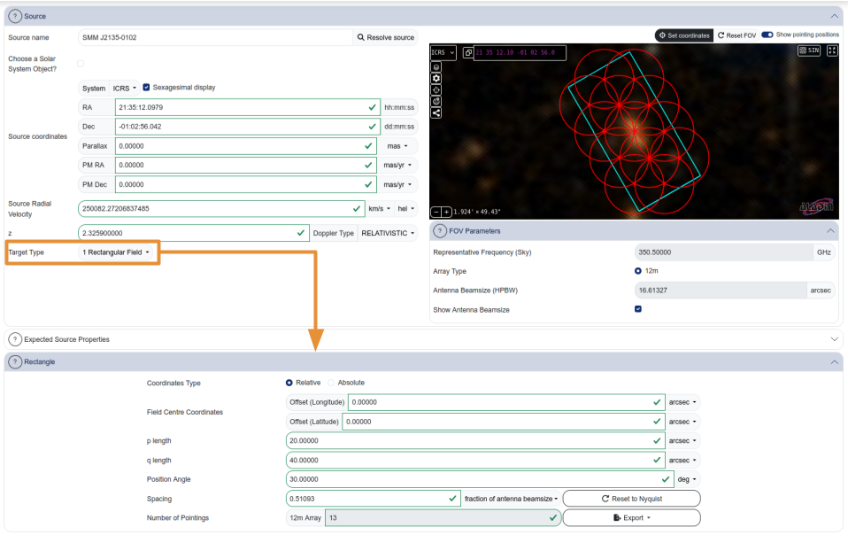

{: .tip}
> 1. In the visualiser, select "Show pointing positions" to overlay the pointings mosaic to the selected rectangle. 
> 2. When you change a value in the "Rectangle" section, press "tab" to update the visualizer. 

{: .note }
> No interactivity is currently implemented for rectangles in the visualiser — you cannot drag or resize the rectangle. All parameters must be entered manually. The "Show pointing positions" toggle displays the individual pointings within the rectangle.

{: .tip }
> Pointings can be defined in **CARTA** and imported into the OT using the import button. This is especially useful for complex mosaic patterns. The file format must match what the OT expects — consult the [OT documentation](https://almascience.eso.org/proposing/observing-tool) for the specification.

### Expected Source Properties

At the bottom of the Field setup, you specify the expected source properties:

- **Peak Continuum Flux Density per Synthesized Beam** (Jy/beam)
- **Continuum Linear Polarization** (per cent)
- **Continuum Circular Polarization** (per cent)
- **Peak Line Flux Density per Synthesized Beam** (Jy/beam) — for spectral line observations
- **Line Width** (km/s) — for spectral line observations

These values are used by the OT to compute signal-to-noise estimates and to populate the technical justification summary. They should be your best estimates based on existing data or theoretical predictions.

{: .important }
> These are the expected flux densities **at the angular resolution you are requesting**, not the total integrated flux of the source. If you are requesting higher angular resolution than previous observations, the peak flux per beam may be significantly lower. See the [science background](06_science_background.md) page for guidance on how to estimate peak flux from existing data at different resolutions.

### Managing sources

Sources within a science goal can be added, imported from file, exported, or deleted using the buttons in the sidebar under "Field setup". The **+** button adds a new source; the import/export buttons handle source lists in various formats.

---

## Spectral Setup

The Spectral Setup defines what frequencies you observe and with what spectral resolution.

### Visualisation panel

The top of the Spectral Setup shows an interactive frequency visualisation. The x-axis shows frequency (both observed and rest frame), and the display includes:

- **Receiver band** boundaries (selectable bands highlighted)
- **Atmospheric transmission** curve
- **Spectral windows** (the coloured blocks showing your configured basebands)
- **DSB (double-sideband) image** overlay — useful for identifying potential contamination from the image band

You can zoom in/out, pan to a specific frequency, zoom to the full band, or reset the view using the controls in the top-right corner of the visualisation panel.

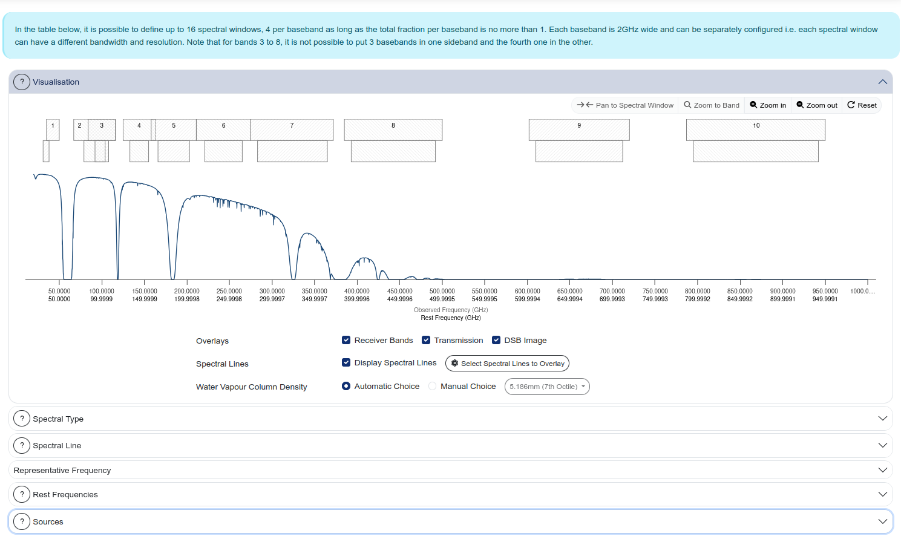

### Spectral Type

Below the visualisation, you select the **Spectral Type**:

- **Spectral Line** — for observations targeting one or more spectral lines. You configure each baseband individually, placing spectral windows on specific transitions.
- **Single Continuum** — for broadband continuum observations. The four basebands are placed automatically to maximise bandwidth coverage.
- **Spectral Scan** — for frequency surveys covering a continuous frequency range.

The polarisation products are also selected here: **XX** (single polarisation), **DUAL** (default, recommended for most observations), or **FULL** (full polarisation — only if your science requires it).

**From the ALMA Users guide:** In Single Polarization mode, only a single input polarization (XX) is recorded. Dual Polarization setup is used, separate spectra are obtained for the cross-correlated parallel hands (XX and YY).  Observations to measure the full intrinsic polarization (XX, XY, YX and YY) of sources are also offered for 12m Array TDM and FDM observations in Bands 1 through 7 as well as the stand-alone 7m Array in Bands 1 and 3 through 7.

### Spectral line configuration

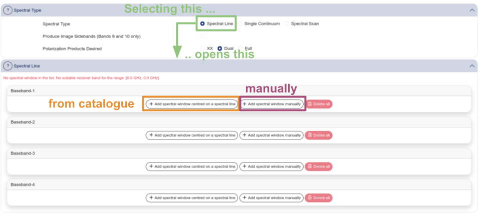

When the spectral type is set to "Spectral Line", you configure each of the four basebands individually. For each baseband, the table shows:

- **Fraction** — what fraction of the baseband is used (typically "Full")
- **Centre Freq (rest, topo)** — the rest-frame and sky frequencies
- **Centre Freq (sky, topo)** — the observed sky frequency
- **Transition** — the spectral line name (or "continuum" for basebands used for continuum)
- **Bandwidth, Resolution (smoothed)** — the total bandwidth and spectral resolution
- **Spec. Avg.** — spectral averaging factor
- **Representative Window** — select which spectral window is used for sensitivity calculations

{: .tip }
One of your spectral windows should be marked as the **Representative Window** (the radio button in the rightmost column). This is the window used by the OT to calculate the sensitivity and time estimate. Choose the spectral window that is most relevant to your primary science goal.

### Spectral line picker

To add a spectral line to a baseband, click "Add spectral window centred on a spectral line" to open the spectral line picker (orange box "from catalogue" in the image above). This tool lets you search for transitions by:

- **Transition filter** — molecule name (e.g. "CO")
- **ALMA Bands** — restrict to specific bands
- **Sky Frequency range** — in GHz
- **Upper-state Energy** — in K
- **Molecular Filter/Environment** — filter by astrophysical environment

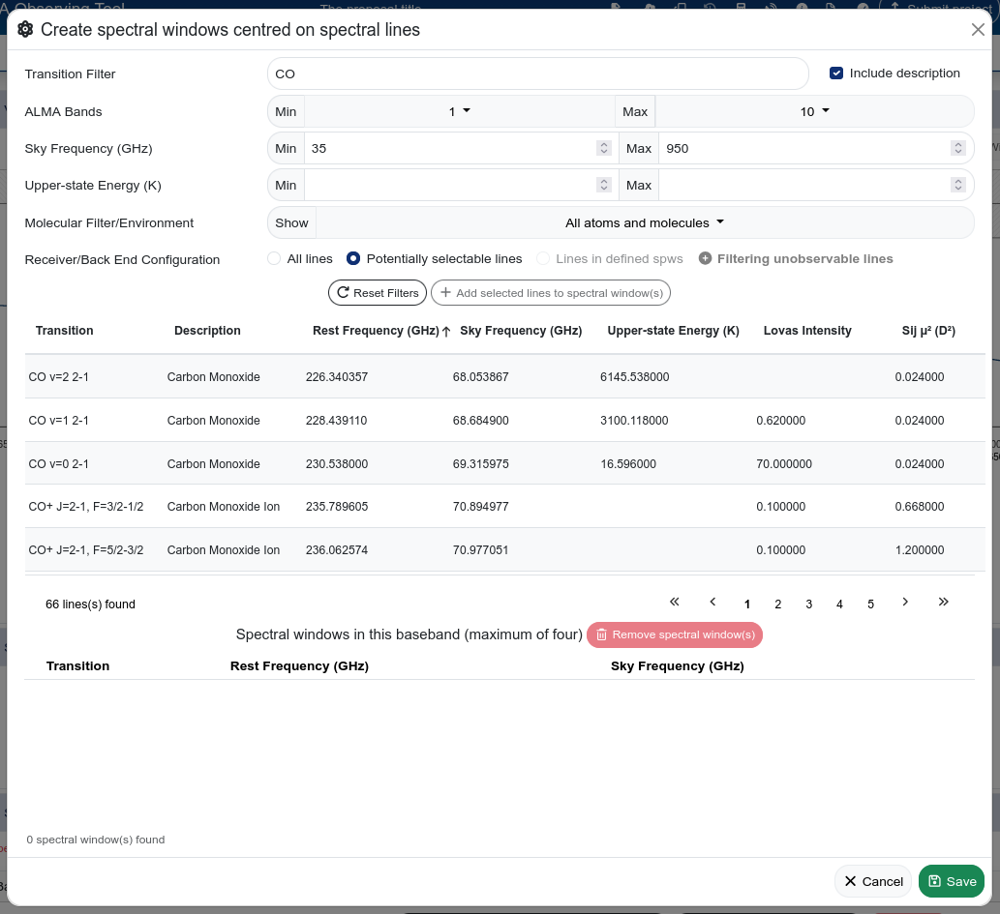

{: .warning }
> When using the **Transition Filter** field (e.g. "CO" line in image), you need to **click outside the field** (or press Tab) to trigger the search and show the list below. Simply pressing Enter in the filter field does not always work.

{: .note }
> The spectral line catalogue in the OT is based on an **offline copy** of Splatalogue and does not contain all known transitions. If your line is not listed, you can add a spectral window manually by specifying the rest frequency directly in the baseband configuration table. Use [Splatalogue](https://splatalogue.online/) to look up the rest frequency.

### Spectral resolution: TDM vs FDM

The spectral resolution is set per baseband:

- **Low spectral resolution (TDM)** — Time Division Mode. Each baseband covers 2 GHz (effective ~1.875 GHz) with 128 channels. This gives a channel width of ~15.6 MHz (~15–30 km/s depending on frequency). Use this for continuum observations or when you only need to detect a line, not resolve its profile.
- **High spectral resolution (FDM)** — Frequency Division Mode. Each baseband can be subdivided into narrower spectral windows with finer channel spacing. Use this when you need to resolve the line profile (e.g. for kinematics).

### Known issue: Band 2 Single Continuum

{: .warning }
> For Band 2, the **Single Continuum** spectral type only takes advantage of the broader IF range when using the default sky frequency. If you need a continuum observation at a non-default frequency with wider spectral window separation, use the **Spectral Line** type instead and configure the basebands manually as continuum windows with the desired separation. This is documented in the [OT FAQ and known issues](https://almascience.eso.org/proposing/observing-tool/faq-and-known-issues).

---

## Calibration Setup

The Calibration Setup panel controls how calibration observations are handled.

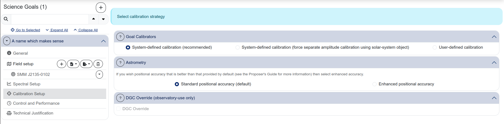

### Goal Calibrators

Three options are available:

- **System-defined calibration (recommended)** — the observatory selects the calibrators automatically. This is the default and is appropriate for the vast majority of proposals.
- **System-defined calibration (force separate amplitude calibration using solar-system object)** — forces the use of a solar system object for amplitude calibration. Use this only if your science requires particularly accurate absolute flux calibration.
- **User-defined calibration** — you specify the calibrators manually. This is rarely needed and should only be used if you have a specific reason.

{: .tip }
Unless you have a compelling scientific reason to change the calibration strategy, leave the default "System-defined calibration (recommended)". Not that any change to the system-defined calibration will have to be justified in the Technical Justification.

### Astrometry

Two options:

- **Standard positional accuracy (default)** — adequate for most observations.
- **Enhanced positional accuracy** — select this if your science requires better astrometric precision than the standard. See the Proposer's Guide for details on what enhanced accuracy provides.

### DGC Override

This section is for observatory use only and should not be modified by proposers.

---

## Control and Performance

This is where you specify the observing performance you need: angular resolution, sensitivity, and time constraints. The panel is divided into three sub-tabs.

### Desired Performance

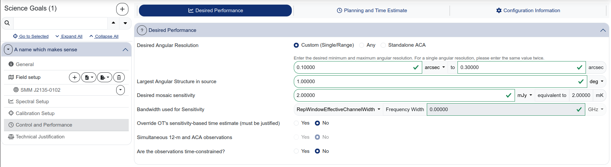

**Desired Angular Resolution:**  
The selector offers three modes:

- **Custom (Single/Range)** — specify a minimum and maximum angular resolution. If you want a single specific resolution, enter the same value in both fields.
- **Any** — the observatory chooses the best configuration. Use this only if your science is genuinely insensitive to the angular resolution.
- **Standalone ACA** — observations with the 7m array only (no 12m array).

{: .new }
In the web-based OT, the "Single" and "Range" options from the desktop OT have been merged into "Custom". To request a single angular resolution, enter the same value in both the minimum and maximum fields.

**Largest Angular Structure in source:**  
Enter your best estimate of the largest angular scale present in the emission you want to detect. This value determines whether ACA observations are needed and affects the configuration selection.

**Desired mosaic sensitivity:**  
The rms noise level you want to achieve, in mJy (or the equivalent in brightness temperature, shown automatically). This is the key parameter driving the time estimate.

**Bandwidth used for Sensitivity:**  
For spectral line observations, this is the velocity width of the channel in which you want to achieve the specified sensitivity. For continuum, this is typically set to the full aggregate bandwidth (set automatically when using "RepWindowEffectiveChannelWidth" or similar options).

{: .tip }
> The bandwidth used for sensitivity is **not** the total bandwidth of the spectral window. It is the width of a single velocity channel over which the rms is evaluated. For a line observation, this should match the velocity resolution you plan to use for your science analysis.
>
> For example, if you expect a line with FWHM = 600 km/s and want 6 independent measurements across the profile, set the bandwidth for sensitivity to ~100 km/s.

**Override OT's sensitivity-based time estimate:**  
Set this to "Yes" only if you have a specific reason to request more or less time than the OT calculates. You must justify this in the Technical Justification.

**Simultaneous 12-m and ACA observations:**  
Whether the 12m and ACA observations should be taken simultaneously.

**Are the observations time-constrained?:**  
Set to "Yes" if your observations require a specific scheduling window (e.g. for monitoring, transient follow-up, or coordination with other facilities).

### Planning and Time Estimate

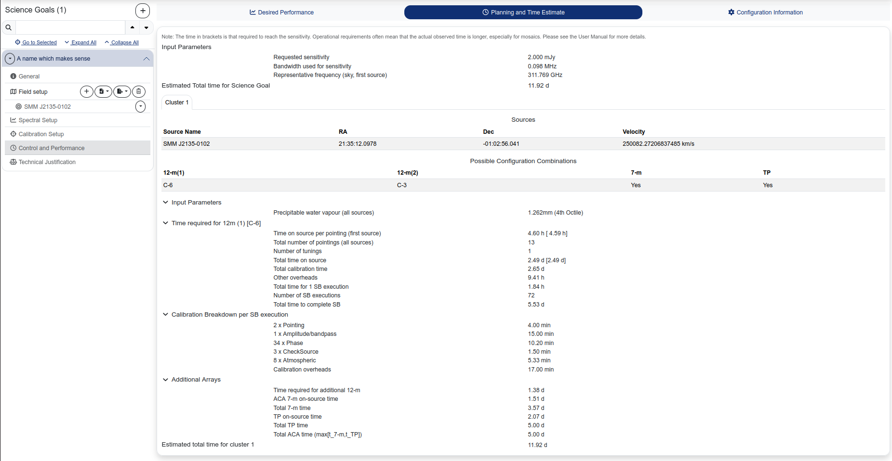

This sub-tab shows the result of the OT's time calculation. It includes:

- **Input Parameters** — a summary of the sensitivity, bandwidth, and frequency used for the calculation.
- **Estimated Total time for Science Goal** — the total time including calibration and overheads.
- **Sources** — a list of sources with coordinates and velocities.
- **Possible Configuration Combinations** — which 12m configurations, 7m, and TP arrays are needed.
- **Time breakdown** — time on source, calibration time, overheads, number of scheduling blocks (SBs), and total time per configuration.
- **Calibration Breakdown per SB execution** — detailed breakdown of calibration scans (pointing, amplitude/bandpass, phase, atmospheric).
- **Additional Arrays** — ACA 7m and TP time if requested.

{: .note }
The time shown in brackets is the time required to reach the requested sensitivity. The operational time (total time for the SB execution) is often longer, especially for mosaics, because of overheads and calibration requirements. The Estimated Total time includes all of these contributions.

### Configuration Information

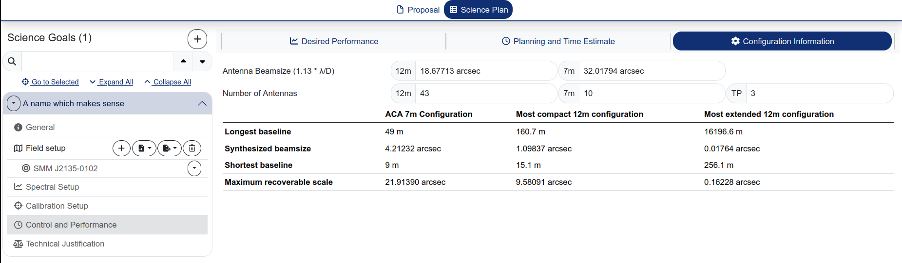

This sub-tab shows a summary of the available array configurations at the frequency of your science goal. For each configuration, it lists the longest and shortest baselines, the synthesized beamsize, and the maximum recoverable scale.

The **Configuration Tables** button in the header bar provides more detailed information, including a table with angular resolution and MRS as a function of declination for each named configuration (ACA, C-1 through C-10).

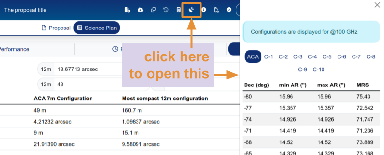

{: .new}
Configuration Tables are a new feature which was not present in the desktop OT. The angular resolution numbers are computed assuming 100 GHz and should thus be re-scaled by the PI to the frequencies they are interested in.

---

## Technical Justification

The Technical Justification panel is where you provide free-text justification for the technical choices in your science goal. It is divided into three sections, each with a summary of the relevant parameters computed by the OT and a text field for your justification.

<!-- IMAGE NEEDED: technical_justification.png
     Screenshot of the Technical Justification panel showing all
     three sections (Sensitivity, Imaging, Correlator configuration)
     expanded, with the parameter summaries visible and the text
     fields (which can be empty or contain example text).
     
     Showing all three sections in one screenshot helps users
     understand the structure. If the screenshot is too long, 
     showing at least the Sensitivity section in detail is the
     priority.

-->

### Sensitivity

The OT displays the requested and achieved RMS, the bandwidth, and the resulting S/N for both continuum and line observations. You must justify your requested RMS and resulting S/N.

{: .tip }
For line observations, also justify the bandwidth used for the sensitivity calculation. Explain why the chosen channel width is appropriate for your science (e.g. "we need 6 independent velocity channels across the expected line FWHM of 600 km/s").

### Imaging

The OT displays the requested angular resolution range and the largest angular scale. You must justify these choices for your source(s).

### Correlator configuration

Justify your correlator setup: the number of spectral resolution elements per line width, and whether spectral averaging could be applied to reduce the data rate.

{: .warning }
> All three Technical Justification text fields are **required** and must each contain at least 50 characters. The proposal will not pass validation if any of them are left blank or too short.

---

## Summary views

At the top of the Science Plan tab, three summary views provide an overview across all science goals:

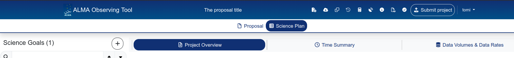

{: .tip}
Remember that by clicking on the "Science Plan" icon at the top of the page (under the header bar) it is always possible to come back to the summary views page.

### Project Overview

A table listing all science goals with their key parameters: number of sources, band, spectral type, number of spectral windows, polarisation, calibration setup, representative frequency, angular resolution, largest scale, and sensitivity.

### Time Summary

A table showing the total and calibration time for each science goal, broken down by array (12m configuration 1, 12m configuration 2, combined 12m, ACA 7m, ACA TP, and overall total).

### Data Volumes & Data Rates

A table showing the estimated data volume and average data rate for each science goal, broken down by array type.

---

[← The Proposal section](04_proposal_section.md) · [Next: Science background →](06_science_background.md)
