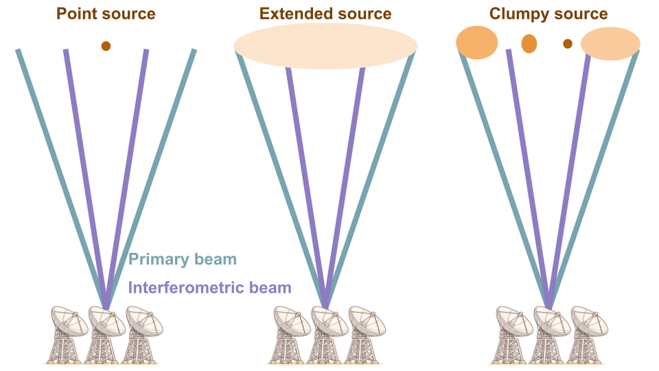

{: .warning}
This page is under construction

# Science background

This page covers the technical foundations you need to prepare a sound ALMA proposal. The concepts discussed here — flux estimation, largest recoverable scale, ACA usage, and spectral line sensitivity — are general and apply to any proposal regardless of the specific science case.

If you are already familiar with interferometry and have prepared ALMA proposals before, you may want to skim this page and jump to the [worked example](07_worked_example.md).

---

## Flux density and brightness temperature

The relationship between flux density and brightness temperature is central to planning interferometric observations. In the Rayleigh-Jeans approximation:

$$
S = \frac{2\,k\,T\,\Omega_S}{\lambda^2}
$$

where $S$ is the flux density (Jy), $T$ is the brightness temperature (K), $k$ is the Boltzmann constant, and $\Omega_S$ is the source solid angle (sr). For a Gaussian beam with half-power beam width $\theta_b$:

$$
\Omega_S = \frac{\pi\,\theta_b^2}{4\ln 2}
$$

The inverse relation gives the brightness temperature from a measured flux density:

$$
T = \frac{\lambda^2\,S}{2\,k\,\Omega_S}
$$

These relations are important because the OT asks for **peak flux density per synthesized beam** — a quantity that depends on both the intrinsic source brightness and the angular resolution of the observation.

---

## Peak flux estimation

When planning observations at a different angular resolution than existing data, you need to estimate what the peak flux density per beam will be at the new resolution. How you do this depends on the source morphology.

### Point source

For a source that is unresolved (angular size much smaller than the beam), the flux density in Jy/beam is independent of the beam size. A point source has the same peak flux density regardless of the angular resolution.

The brightness temperature, on the other hand, scales as:

$$
T \propto \frac{1}{\theta_\mathrm{beam}^2}
$$

A point source observed at higher resolution appears brighter in temperature but has the same flux in Jy/beam.

### Extended uniform source

For a source that is resolved and has roughly uniform surface brightness, the brightness temperature is independent of the beam size, but the flux density per beam scales as:

$$
S_\mathrm{beam} \propto \theta_\mathrm{beam}^2
$$

This means that if you go from a $10''$ beam to a $1''$ beam, the peak flux density per beam drops by a factor of 100.

{: .important }
> This is the most common source of errors in time estimates. A source that is bright and easy to detect at low resolution may require enormously more time at high resolution if it is extended and uniform. Two different assumptions about source morphology (point source vs. extended) can lead to integration time estimates that differ by a factor of $10^4$.

### Fragmented or clumpy source

Real sources are often neither perfect point sources nor perfectly uniform. A source that appears unresolved in existing data may break up into multiple components at higher resolution. In this case, the peak flux per beam depends on the number of components, their sizes, and their relative flux distribution.

If you have prior data at a resolution $\theta_\mathrm{prior}$ and you plan to observe at $\theta_\mathrm{ALMA}$:

- If the source will remain **unresolved** at $\theta_\mathrm{ALMA}$ (i.e. the source size is smaller than $\theta_\mathrm{ALMA}$), the peak flux is unchanged:

$$
S_\mathrm{peak}^\mathrm{ALMA} = S_\mathrm{peak}^\mathrm{prior}
$$

- If the source will be **resolved into a single component** of angular size $D \approx \theta_\mathrm{prior}$, assumed to have uniform brightness within $D$:

$$
S_\mathrm{peak}^\mathrm{ALMA} = S_\mathrm{peak}^\mathrm{prior} \times \left(\frac{\theta_\mathrm{ALMA}}{\theta_\mathrm{prior}}\right)^2
$$

- If the source will be **resolved into $N$ components**, each of angular size $D_\mathrm{cc}$, with the flux equally and uniformly distributed among them:

$$
S_\mathrm{peak}^\mathrm{ALMA} = \frac{S_\mathrm{peak}^\mathrm{prior}}{N} \times \left(\frac{\theta_\mathrm{ALMA}}{D_\mathrm{cc}}\right)^2
$$

Each of these assumptions leads to a very different required sensitivity. The [worked example](07_worked_example.md) illustrates this with numerical values.

---

## Largest recoverable scale

An interferometer does not measure all spatial frequencies. Baselines shorter than a minimum length $D_\mathrm{min}$ are not sampled, which means that emission on angular scales larger than the **maximum recoverable scale (MRS)** is filtered out. The MRS is approximately:

$$
\mathrm{MRS\,[arcsec]} \approx \frac{0.6\,\lambda}{D_\mathrm{min}}
$$

or equivalently:

$$
\mathrm{MRS\,[arcsec]} \approx \frac{37200}{D_\mathrm{min}\,[\mathrm{m}] \times \nu\,[\mathrm{GHz}]}
$$

{: .note }
The factor 0.6 (or equivalently 37200 in the second form) is a conventional definition. The actual sensitivity to large-scale emission drops gradually rather than cutting off sharply at the MRS.

### What this means in practice

For a Gaussian source with FWHM comparable to or larger than the MRS, the interferometer recovers only a fraction of the total flux. The larger the source relative to the MRS, the more flux is lost.

<!-- IMAGE NEEDED: largest_recoverable_scale.png
     Plot showing visibility amplitude vs. baseline length for
     Gaussian sources of different sizes (e.g. FWHM = 2", 5", 10",
     15"). The x-axis shows baseline length in metres, with vertical
     lines indicating D_min for the compact and extended 12m
     configurations. The plot should clearly show how sources larger
     than the MRS have near-zero visibility at the shortest available
     baselines.
     
     The Mignano_liuzzo slides (pages 7-10) have exactly this plot.
     You could reproduce it or create a cleaner version. This figure
     is essential for understanding why ACA is needed and when
     flux will be lost.
-->

### Practical guidelines

When deciding whether you need to worry about flux filtering:

- If the **LAS of your source** $<$ **MRS** of the requested configuration: you are fine, no flux loss expected.
- If the **LAS of your source** $>$ **MRS**: you will lose flux from large-scale emission. You should either request a more compact configuration (larger MRS) or request ACA observations to fill in the short spacings.
- If the **LAS of your source** $\gg$ **MRS**: even ACA may not be sufficient to recover all the flux. Total power (TP) observations may be needed for spectral line observations.

{: .tip }
> The MRS depends on the array configuration and the observing frequency. The Configuration Information sub-tab in the OT (or the configuration tables accessible from the header bar) shows the MRS for each configuration at your observing frequency. Check these values against your estimated LAS before finalising your proposal.

---

## When to request ACA

The Atacama Compact Array (ACA) consists of:

- The **7m array** — twelve 7-metre antennas providing shorter baselines than the 12m array, thus recovering larger angular scales.
- **Total Power (TP)** antennas — four 12-metre antennas used as single dishes, providing zero-spacing information. TP is available **for spectral line observations only** (not continuum).

### Decision logic

The general reasoning is:

1. Estimate the **largest angular scale (LAS)** in your source.
2. Check the **MRS** of the 12m array configuration you plan to use (from the OT Configuration Information tab).
3. If LAS $<$ MRS: **no ACA needed**.
4. If LAS $>$ MRS of the 12m array, but LAS $<$ MRS of the 7m array: request **7m array** observations.
5. If LAS $>$ MRS of the 7m array (spectral line only): you may also need **TP** observations.

{: .note }
> The 7m array has baselines ranging from approximately 9 m to 49 m. Its MRS is significantly larger than that of the 12m array, even in the most compact configuration. However, there is a gap in baseline coverage between the longest 7m baseline and the shortest 12m baseline — successful combination of 7m and 12m data requires that the 12m configuration is compact enough to overlap in uv-coverage with the 7m array.

### Impact on time estimates

Requesting ACA observations increases the total time of your proposal. The OT calculates the ACA time automatically based on the sensitivity and configuration requirements. Keep in mind that ACA time is a shared and limited resource — request it only when your science genuinely requires it.

<!-- IMAGE NEEDED: lrs_and_aca.png
     Plot showing visibility vs. baseline length (similar to the
     LRS plot above) but with the ACA 7m array baseline range
     and the 12m single-dish TP coverage overlaid. This should
     illustrate how the 7m array fills in baselines shorter than
     the 12m minimum, and how TP fills in the zero-spacing.
     
     The Mignano_liuzzo slides (page 11) have this figure. It
     clearly shows the complementary coverage of the three array
     components.
-->

---

## Spectral line sensitivity

For spectral line observations, the sensitivity calculation has additional nuances compared to continuum.

### Peak flux vs. integrated flux

A spectral line is characterised by its **integrated flux** (area under the line profile, in Jy km/s) and its **peak flux density** (the maximum of the line profile, in Jy or mJy). For a Gaussian line profile with FWHM $\Delta v$:

$$
S_\mathrm{peak} = \frac{F_\mathrm{int}}{\mathrm{FWHM}}
$$

where $F_\mathrm{int}$ is the velocity-integrated flux (in Jy km/s) and FWHM is in km/s. The rms you request in the OT should be:

$$
\mathrm{rms} = \frac{S_\mathrm{peak}}{\mathrm{S/N}}
$$

where S/N is your desired signal-to-noise ratio **on the peak** of the line, measured in a channel of width equal to the "Bandwidth used for Sensitivity" that you specify in the OT.

### Channel width and sensitivity

The noise per channel scales as:

$$
\Delta S \propto \frac{1}{\sqrt{\Delta\nu \cdot \Delta t}}
$$

where $\Delta\nu$ is the channel bandwidth and $\Delta t$ is the integration time. Wider channels give lower noise per channel (better sensitivity) but coarser velocity resolution. The choice of channel width depends on your science: mapping the overall line emission needs fewer, wider channels; resolving kinematics requires narrower channels.

{: .important }
> The peak flux density of a line does **not** depend on the channel width (as long as the channel is narrower than the line FWHM). But the noise does. So the S/N on the peak improves with wider channels — at the cost of velocity resolution. The channel width you specify as "Bandwidth used for Sensitivity" in the OT must match the velocity resolution at which you want to achieve the requested S/N.

### Estimating line flux from existing data

When planning ALMA observations of a spectral line detected with a different instrument, you need to account for potential differences in:

- **Angular resolution** — if the source is resolved by ALMA but was unresolved in the prior observations, the peak flux per beam will be lower (see the [peak flux estimation](#peak-flux-estimation) discussion above).
- **Line ratios** — if you are observing a different transition than what was previously detected, you need to estimate the flux ratio between the two transitions. This typically requires assumptions about the excitation conditions (temperature, density, optical depth).

{: .tip }
> When estimating the flux of a line that has not been directly observed, be explicit about your assumptions. If you assume a line ratio (e.g. $\mathrm{CO(3\text{-}2)/CO(9\text{-}8)} = 2.5$), state it clearly and justify it in the scientific case and technical justification. Reviewers appreciate transparency about the uncertainties.

---

## Summary

Before specifying the technical setup in the OT, make sure you have thought through:

1. **Is my source a point source or extended at the requested resolution?** This determines the peak flux per beam and therefore the required sensitivity.
2. **Is the largest angular scale of my source smaller than the MRS?** This determines whether ACA is needed.
3. **What channel width do I need for my spectral line science?** This determines the bandwidth used for sensitivity and the resulting integration time.
4. **What assumptions am I making about line ratios, morphology, or flux distribution?** These should be clearly stated and justified in the proposal.

For a concrete numerical example applying all of these concepts, see the [worked example](07_worked_example.md).

---

[← The Science Plan](05_science_plan.md) · [Next: Worked example →](07_worked_example.md)