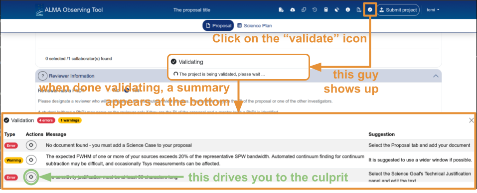
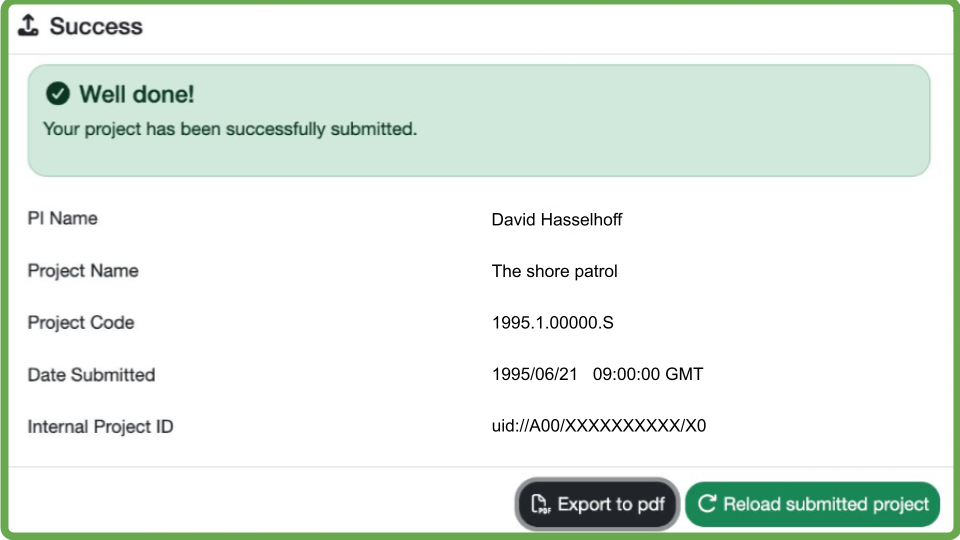
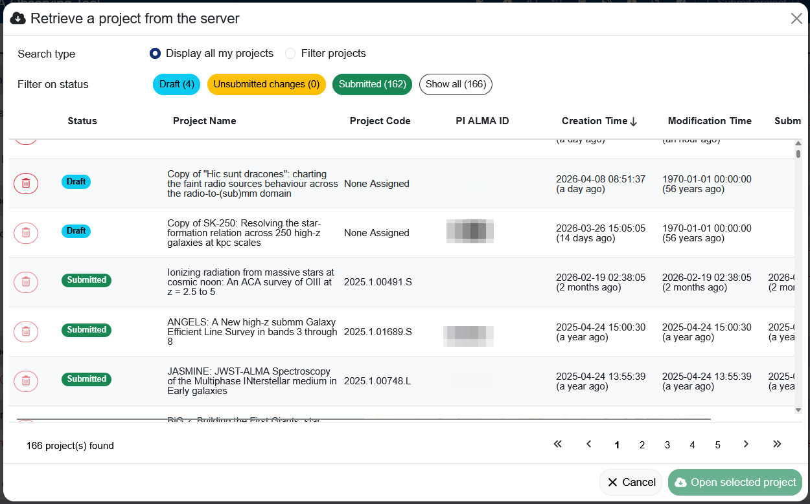
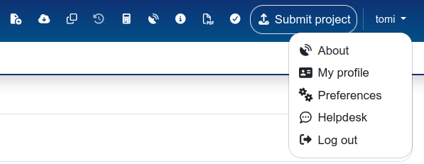

# Validation and submission

You have filled in all the fields, configured your science goals, and written your technical justification. Before submitting, there are a few more steps: validating the proposal, submitting it, and understanding how to manage it afterwards in the staging area.

---

## Validating your proposal

The **Validate** button (checkmark icon in the header bar) runs a series of checks on your proposal and reports any errors or warnings.

After clicking Validate, a panel appears at the bottom of the page listing all issues found. Each issue shows:

- **Type** — Error (red) or Warning (yellow). Errors must be fixed before submission; warnings are advisory.
- **Actions** — a button that navigates directly to the field causing the issue.
- **Message** — a description of the problem.
- **Suggestion** — how to fix it.

Common validation errors include:

- **Missing required fields** — project name, abstract, scientific category, source name, expected source properties.
- **Technical justification too short** — each of the three justification text fields (Sensitivity, Imaging, Correlator configuration) must contain at least 50 characters.
- **Inconsistent spectral setup** — e.g. a spectral line observation without a representative window selected, or missing expected source flux values.

{: .tip }
Run validation early and often — don't wait until the last minute before the deadline. Some errors require going back to rethink parts of the setup, not just filling in a missing field.

---

## Submitting your proposal

Once validation passes with no errors, click the **Submit project** button (top-right of the header bar, green button).

After successful submission, a confirmation dialog appears showing:

- **PI Name**
- **Project Name**
- **Project Code** — the unique identifier assigned to your proposal (e.g. `2026.1.XXXXX.S`)
- **Date Submitted**
- **Internal Project ID**

The dialog also offers two actions:

- **Export to PDF** — download a PDF summary of the submitted proposal.
- **Reload submitted project** — reloads the proposal in its submitted state.

{: .important }
> Once submitted, the proposal can only be **retracted** via a helpdesk ticket. You cannot delete or withdraw a submitted proposal from within the OT. Make sure your proposal is complete and correct before submitting.

---

## The staging area

The **staging area** is where all your proposals (drafts and submitted) are stored on the server. You access it through:

- **"Retrieve a project from the server"** — on the welcome screen or from the header bar. This opens the proposal for editing.
- **"Open project as new proposal"** — on the welcome screen or from the header bar. This creates a copy of the selected proposal as a new draft.

### Viewing your proposals

The staging area lists all proposals to which you have access (as PI, CoPI, or CoI). For each proposal, the table shows:

- **Status** — Draft, Submitted, or Submitted with Unsubmitted Changes
- **Project Name**
- **Project Code**
- **PI ALMA ID**
- **Creation Time**
- **Modification Time**
- **Submission Time** (for submitted proposals)

### Filtering proposals

You can filter proposals by status using the buttons at the top of the staging area (Draft, Unsubmitted changes, Submitted, Show all).

You can also switch to **"Filter projects"** mode and search by:

- PI ALMA ID
- CoI ALMA ID
- CoPI ALMA ID
- Project Name
- Project Code
- Cycle

### Proposal statuses

Proposals can be in one of three states:

**Draft** — the proposal has been created but not yet submitted. Draft proposals can be freely edited and **deleted** from the staging area. It is good practice to clean up draft proposals that you no longer need.

**Submitted** — the proposal has been submitted to the ALMA archive. Submitted proposals **cannot be deleted** from the staging area. They can only be retracted via a helpdesk ticket.

**Submitted with Unsubmitted Changes** — the proposal was submitted, but modifications have been made since the last submission. The submitted version is preserved in the archive; the unsubmitted changes exist only in the staging area.

{: .warning }
> If a submitted proposal has unsubmitted changes, you can **revert** it to the last submitted version using the revert button in the header bar (the clock/arrow icon). After reverting, the unsubmitted changes are permanently lost.

### Making a copy

The **"Open project as new proposal"** function creates a copy of any proposal (draft or submitted) as a new draft. This is useful for:

- Testing different observing strategies without modifying your original proposal.
- Reusing the setup from a previous cycle's proposal as a starting point for a new one.
- Letting a collaborator experiment with changes on a separate copy.

If the source proposal is in the "Submitted with Unsubmitted Changes" state, you are given the choice of which version to copy (the submitted version or the version with unsubmitted changes).

{: .new }
> `.aot` files no longer exist. It is not possible to save a proposal to disk or to import an `.aot` file from a previous cycle. If you need to recreate a proposal from a previous cycle, you must build it from scratch in the web-based OT. You can, however, copy any proposal you have access to in the staging area using the "Open project as new proposal" function.

---

## Resubmitting a proposal

If you need to modify a submitted proposal (e.g. to fix an error noticed after submission, or to update the science case before the deadline), you can:

1. Open the submitted proposal from the staging area.
2. Make your changes — the proposal status changes to "Submitted with Unsubmitted Changes".
3. Click **Submit project** again to resubmit.

The new submission replaces the previous one in the archive. The project code remains the same.

{: .tip }
Before making changes to a submitted proposal, consider whether you might want to preserve the submitted version. If so, make a copy first using "Open project as new proposal", then modify the copy and submit it instead.

---

## Reporting bugs

If you encounter a bug or unexpected behaviour in the web-based OT, you can report it through the ALMA helpdesk. The OT provides a direct link: click on your username (top-right corner of the header bar) and select **"Helpdesk"** from the dropdown menu (which opens by clicking on your username).

Before opening a ticket, check the [OT FAQ and known issues](https://almascience.eso.org/proposing/observing-tool/faq-and-known-issues) page — your issue may already be documented with a workaround.

---

[← Worked example](07_worked_example.md) · [Next: Tips and known issues →](09_tips_and_known_issues.md)
